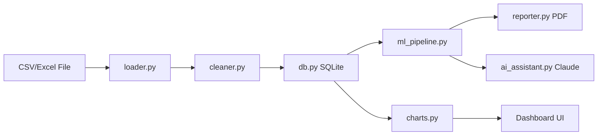
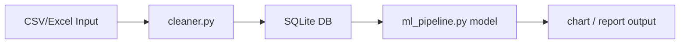

# Architecture

## How to Work
Write in VS Code. Preview this file with the Mermaid Preview extension.
Commit the `docs/` folder to GitHub — GitHub natively renders Mermaid
diagrams inside markdown, so this diagram will show up on the repo page
with no extra setup.

## System Architecture

## Data Flow

The pipeline is linear: a raw file is loaded, cleaned, persisted to the
database, then consumed by the ML pipeline and the charting layer for
final output (dashboard, PDF report, or AI-assisted summary).

## Module Descriptions

### `loader.py`
Reads CSV/Excel files from disk and returns them as pandas DataFrames.
Entry point for getting external data into the pipeline.

**Key functions**
- `load_file(path: str) -> pd.DataFrame` — reads a CSV or Excel file and
  returns a DataFrame.

### `cleaner.py`
Cleans and normalizes raw DataFrames before they're persisted — handling
missing values, type coercion, and column normalization.

**Key functions**
- `clean_dataframe(df: pd.DataFrame) -> pd.DataFrame` — returns a cleaned
  copy of the input DataFrame.

### `db.py`
Wraps a SQLite database connection. Handles inserting cleaned data and
running queries against it. See `docs/SCHEMA.md` for table definitions
(P2).

**Key functions**
- `DatabaseConnector(path: str)` — opens/creates a SQLite DB at `path`.
- `insert_dataframe(df, table_name)` — writes a DataFrame to a table.
- `query(sql: str) -> pd.DataFrame` — runs a SQL query, returns results.
- `close()` — closes the connection.

### `ml_pipeline.py`
Trains and runs the ML model(s) against data pulled from the database.

**Key functions**
- `train_model(df: pd.DataFrame)` — trains a model on the given data.
- `export_model(model, path: str)` — serializes the trained model to disk.

### `charts.py`
Generates charts/visualizations from database query results, feeding the
dashboard UI. See `docs/UI_COMPONENTS.md` for the dashboard layer (P3).

**Key functions**
- `generate_chart(df: pd.DataFrame, chart_type: str)` — builds a chart
  from a DataFrame.

### `reporter.py`
Takes ML pipeline output and produces a PDF report.

**Key functions**
- `generate_report(results, output_path: str)` — writes a PDF summary.

### `ai_assistant.py`
Sends ML results/context to Claude for narrative summaries or Q&A over
the data.

**Key functions**
- `summarize_results(results) -> str` — returns an AI-generated summary.

## API Reference

> TODO: fill in once module signatures are finalized. Suggested format
> per function: name, parameters (with types), return type, and a short
> example call.

## Related Docs
- `docs/SCHEMA.md` — SQL table schemas (P2, documented separately)
- `docs/UI_COMPONENTS.md` — Dashboard UI components (P3, documented
  separately)

## Status
Work in progress — descriptions above are based on the module map in the
task card and the project README. Function signatures should be verified
against the actual source once each module is implemented.
