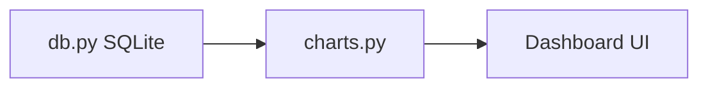

# UI Components

Documents the PyQt5 dashboard UI. Referenced from
`docs/ARCHITECTURE.md`.

## Overview

The dashboard consumes chart output from `charts.py` (which itself reads
from the SQLite DB via `db.py`) and renders it in a PyQt5 desktop window.

## Components

> TODO: replace placeholders below with the real widget/class names once
> the dashboard is implemented. Each component should list its file,
> its purpose, and how it's wired to the rest of the app.

### Main Window

**File:** TBD (e.g. `dashboard.py` or `main.py`)

Top-level `QMainWindow` that hosts the chart view and controls. Launched
via `python src/main.py` per the README.

### Chart View

**File:** `charts.py`

Renders chart output (from `generate_chart()`) inside the dashboard.
Needs to be importable and testable without launching the full GUI —
required for `pytest-qt` tests to run headless in CI (see
`docs/ARCHITECTURE.md` and `.github/workflows/ci.yml`).

### Controls / Toolbar

**File:** TBD

Any file-load, filter, or export controls exposed to the user.

## Testing Notes

- UI tests use `pytest-qt`.
- On Linux CI, tests run under `xvfb-run` (virtual display) since there's
  no real display in the GitHub Actions runner — see `.github/workflows/ci.yml`.
- Backend functions (`loader.py`, `cleaner.py`, `db.py`, `charts.py`,
  `ml_pipeline.py`) must remain importable without triggering
  `QApplication()` at import time, so they can be unit-tested without a
  GUI.

## Status
Work in progress. Component names above are placeholders pending the
actual dashboard implementation.

